# Projekt-Dokumentation
## Projektübersicht

Dieses Projekt umfasst die Einrichtung und Konfiguration der folgenden Dienste für ein KMU:

- MediaWiki: Ein Wiki für firmeninterne Zwecke auf Port 8085.
- Nextcloud: Eine Filesharing- und Kollaborationsplattform auf Port 8080.
- Gogs: Eine Self-Hosted Git-Server-Plattform auf Port 3000.
- Portainer: Ein Docker-Management-Tool auf Port 9000.

Alle Dienste wurden mit Docker-Compose konfiguriert und laufen in Docker-Containern. Die Konfiguration und Verwaltung der Container erfolgt über GitLab.

### Projektstruktur

Wir haben die Projektstruktur wie folgt organisiert:

```plaintext
LB/
├── docs/
|   ├── Arbeitsjournal.md
|   |── Dokumenation.md
│   ├── Testkonzept.md
│   └── README.md
├── services/
│   ├── mediawiki/
│   │   └── docker-compose.yaml
│   ├── nextcloud/
│   │   └── docker-compose.yaml
│   ├── gogs/
│   │   └── docker-compose.yaml
│   └── portainer/
│       └── docker-compose.yaml
└── .gitignore
```
### Voraussetzungen
- Docker und Docker-Compose müssen auf dem Host-System installiert sein.
- Ein GitLab-Konto zur Versionierung und Verwaltung der Konfigurationsdateien.

### Einrichtung der Dienste

#### MediaWiki (Vor Sicherheitsmassnahme)

```yaml
version: '3.8'

services:
  mediawiki:
    image: mediawiki:latest
    container_name: mediawiki
    networks:
      - internal_net
    environment:
      - MEDIAWIKI_DB_TYPE=mysql
      - MEDIAWIKI_DB_HOST=db
      - MEDIAWIKI_DB_NAME=mediawiki
      - MEDIAWIKI_DB_USER=mediawiki
      - MEDIAWIKI_DB_PASSWORD=secret
    volumes:
      - mediawiki_data:/var/www/html
    ports:
      - "8085:80"
    depends_on:
      - db

  db:
    image: mysql:5.7
    container_name: mediawiki_db
    networks:
      - internal_net
    environment:
      - MYSQL_ROOT_PASSWORD=root_password
      - MYSQL_DATABASE=mediawiki
      - MYSQL_USER=mediawiki
      - MYSQL_PASSWORD=secret
    volumes:
      - db_data:/var/lib/mysql

networks:
  internal_net:
    driver: bridge

volumes:
  mediawiki_data:
  db_data:
```
<hr>

#### Nextcloud (Vor Sicherheitsmassnahme)
```yaml
version: '3.8'

services:
  nextcloud:
    image: nextcloud:latest
    container_name: nextcloud
    networks:
      - internal_net
    environment:
      - MYSQL_HOST=db
      - MYSQL_DATABASE=nextcloud
      - MYSQL_USER=nextcloud
      - MYSQL_PASSWORD=secret
    volumes:
      - nextcloud_data:/var/www/html
    ports:
      - "8080:80"
    depends_on:
      - db

  db:
    image: mysql:5.7
    container_name: nextcloud_db
    networks:
      - internal_net
    environment:
      - MYSQL_ROOT_PASSWORD=root_password
      - MYSQL_DATABASE=nextcloud
      - MYSQL_USER=nextcloud
      - MYSQL_PASSWORD=secret
    volumes:
      - db_data:/var/lib/mysql

networks:
  internal_net:
    driver: bridge

volumes:
  nextcloud_data:
  db_data:
```
<hr>

#### Gogs (Vor Sicherheitsmassnahme)
```yaml
version: '3.8'

services:
  gogs:
    image: gogs/gogs:latest
    container_name: gogs
    networks:
      - internal_net
    environment:
      - DB_TYPE=mysql
      - DB_HOST=db:3306
      - DB_NAME=gogs
      - DB_USER=gogs
      - DB_PASSWD=secret
    volumes:
      - gogs_data:/data
    ports:
      - "3000:3000"
      - "2222:22"
    depends_on:
      - db

  db:
    image: mysql:5.7
    container_name: gogs_db
    networks:
      - internal_net
    environment:
      - MYSQL_ROOT_PASSWORD=root_password
      - MYSQL_DATABASE=gogs
      - MYSQL_USER=gogs
      - MYSQL_PASSWORD=secret
    volumes:
      - db_data:/var/lib/mysql

networks:
  internal_net:
    driver: bridge

volumes:
  gogs_data:
  db_data:
```
<hr> 

#### Portainer (Vor Sicherheitsmassnahme)
```yaml
version: '3.8'

services:
  portainer:
    image: portainer/portainer-ce:latest
    container_name: portainer
    networks:
      - internal_net
    ports:
      - "9000:9000"
    volumes:
      - /var/run/docker.sock:/var/run/docker.sock
      - portainer_data:/data

networks:
  internal_net:
    driver: bridge

volumes:
  portainer_data:
```
<hr>

### Dienste starten

Um die Dienste zu starten navigierten wir in die entsprechenden Verzechinisse und führten ```docker-compose up -d``` aus:

```bash
cd ~/LB/services/mediawiki
docker-compose up -d
```

```bash
cd ~/LB/services/nextcloud
docker-compose up -d
```

```bash
cd ~/LB/services/gogs
docker-compose up -d
```

```bash
cd ~/LB/services/portainer
docker-compose up -d
```
### Versionsverwaltung

Alle Konfigurationsdateien wurden im GitLab-Repository versioniert. Der Fortschritt wurde durch regelmässige Commits dokumentiert.
<hr>

#### Repository einrichten und Änderungen pushen

1. Remote-Repository hinzufügen:

```bash
git remote add origin https://gitlab.com/joomla2613824/WISS-LB.git
```
2. Änderungen pushen:

```bash
git add -A
git commit --amend -m "beispiel für doku"
git push origin master --force
```
<hr>

### Einrichten von MediaWiki

##### Jetzt haben wir angefangen das MediaWiki einzurichten, es sah so aus am anfang:

 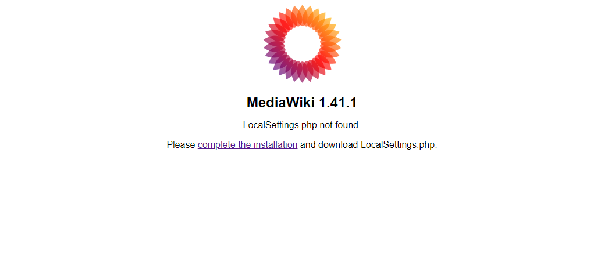

##### Installation:

 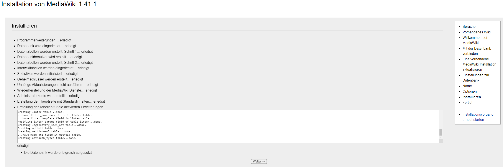

##### LocalSettings.php:

 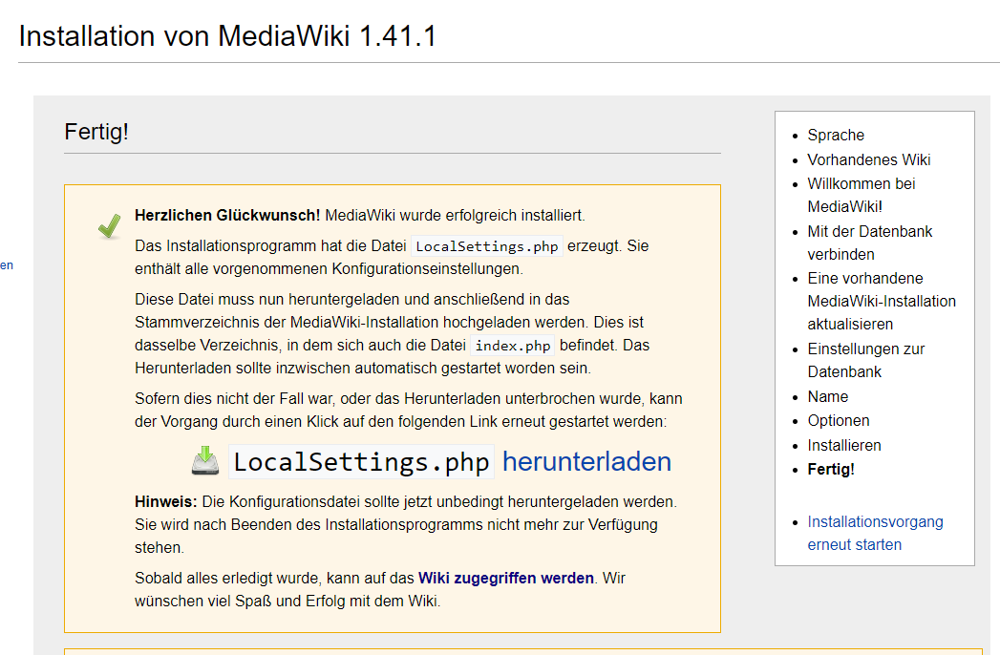

Nachdem wir mit der Konfiguration fertig waren mussten wir LocalSettings.php ins ```mediawiki:/var/www/html/``` Verzechnis kopieren und das machten wir mit dem command ```scp``` auf dem main OS:
```bash
scp "C:\Users\sebiz\Downloads\LocalSettings.php" lyfe@192.168.1.32:/home/lyfe
```
Als nächstes mussten wir das LocalSettings.php ins docker environement verschieben:
```bash
docker cp /home/lyfe/LocalSettings.php mediawiki:/var/www/html/LocalSettings.php
```
##### Small Showcase:

scp:

- 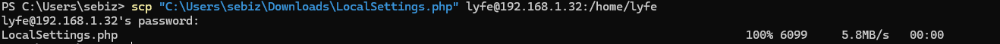

docker cp:

- 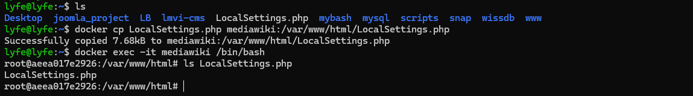

##### So sah das ganze nach dem setup aus:
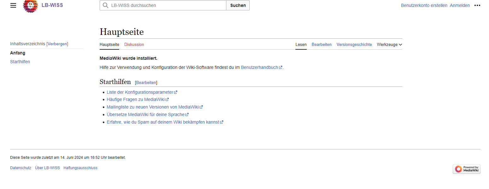

Beim einrichten haben wir auch noch bemerkt das wir keine Admistratoren rechte hatten, deswegen haben wir das LocalSettings.php umgeändert:

```bash
$wgGroupPermissions['*']['createaccount'] = true; # Es war false
$wgGroupPermissions['sysop']['createaccount'] = true; # Es war false
```
<hr>

### Einrichten von NextCloud
Bei NextCloud mussten wir einfach die details des docker-compose.yaml eingeben.
##### Wie es aussieht:
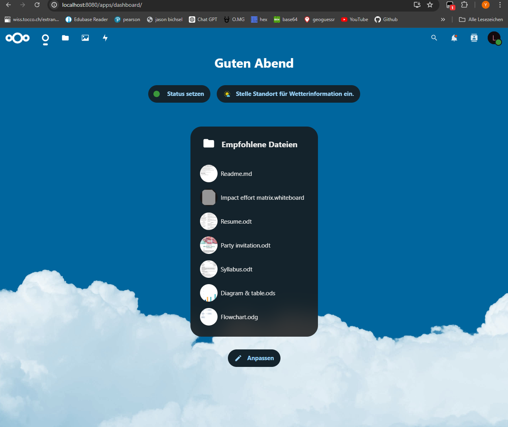
##### Bestätingung des contents:
```bash
docker exec -it nextcloud /bin/bash
cd /var/www/html/config
cat config.php
```
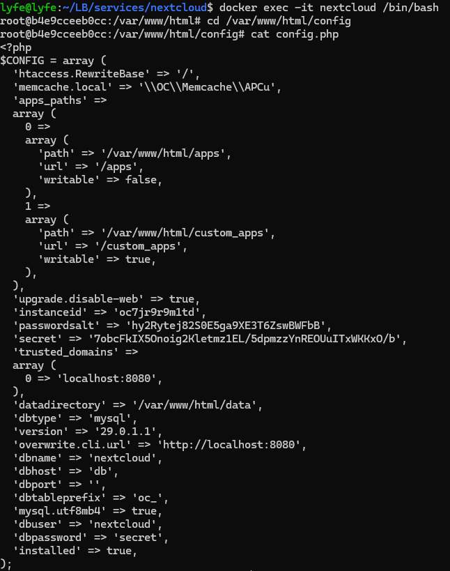
#### Zusammenarbeit
Damit ich und Benicio zusammenarbieten konnten mussten wir im docker environement ``root@6e52e35328f6:/var/www/html/config/config.php`` so ändern das er such zugriff hat auf meine Lokale Instanz, das machte ich so:
```bash
# Man musste meine lokale IP und seine Lokale IP importieren.
  array (
    0 => 'localhost:8080', 
    1 => '172.28.1.15', # benicio ip
    2 => '172.28.1.2', # meine ip
  ),
```
Dazu musste ich noch die Ports Weiterleiten, das sah so aus:

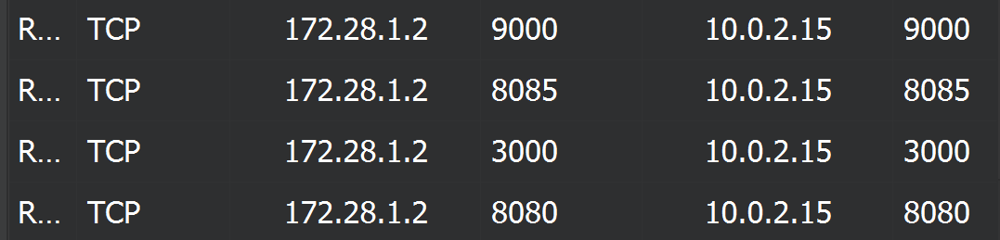

Ausfühlichere erklärung [hier](docs/Zusätzliche%20Arbeit/VerbindungAndererGeräte.md).
<hr>

### Einrichten von Gogs
##### Am anfang der Einrichtung sah es so aus:
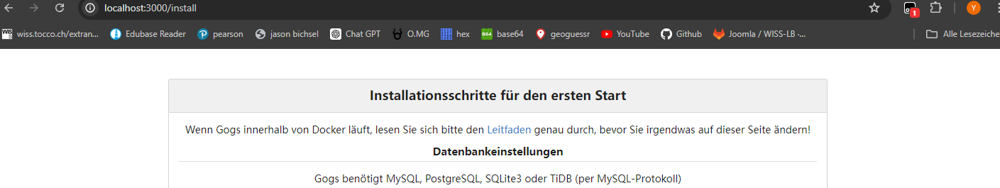
##### Während der installation:
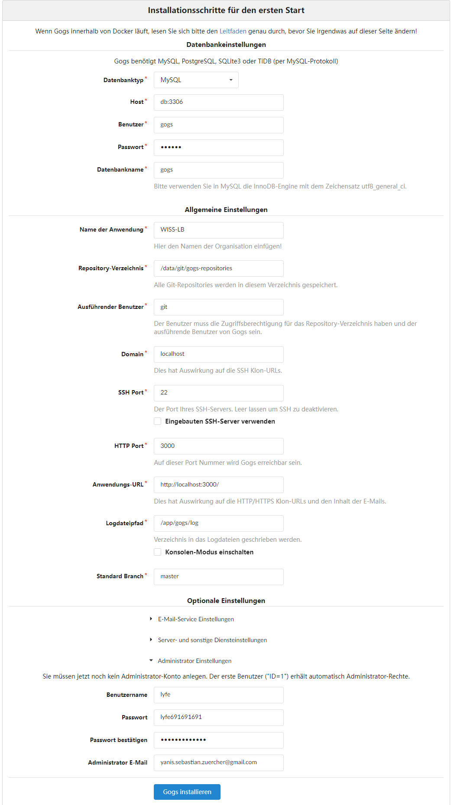
##### Nach der installation:
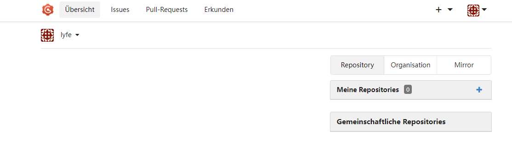
<hr>

### Einrichten von Portainer
##### Am anfang sah es so aus:

##### Nach login:

<hr>


## Passwörter verstecken
Da die Passwörter zurzeit in dem yaml file zu sehen sind sollte man sie aus Sicherheitsgründen in externe dateien tun.
Das erte was man machen soll ist ``.env`` dateien erstellen um die passwörter zu storen.
Die ``.env`` dateien soll man dann im .gitignore listen damit sie nicht gepusht werden also sozusagen ausgeschlossen werden.

1. Navigierten wir in die ordner wo die docker-compose dateien gelistet sind und erstellten ``.env`` dateien
   
Beispiel:
```bash
  MEDIAWIKI_DB_TYPE=beispiel
  MEDIAWIKI_DB_HOST=beispiel
  MEDIAWIKI_DB_NAME=beispiel
  MEDIAWIKI_DB_USER=beispiel
  MEDIAWIKI_DB_PASSWORD=beispiel
  MYSQL_ROOT_PASSWORD=beispiel
  MYSQL_DATABASE=beispiel
  MYSQL_USER=beispiel
  MYSQL_PASSWORD=beispiel
 ```
2. Als nächstes mussten wir die ``docker-compose.yaml`` dateien updaten und die Passwörter entfernen und mit dem pfad der ``.env`` datei ersetzen.
  #### Sicheres MediaWiki:
```yaml
version: '3.8'

services:
  mediawiki:
    image: mediawiki:latest
    container_name: mediawiki
    networks:
      - internal_net
    env_file:
      - ./mediawiki.env
    volumes:
      - mediawiki_data:/var/www/html
    ports:
      - "8085:80"
    depends_on:
      - mediawiki_db

  mediawiki_db:
    image: mysql:5.7
    container_name: mediawiki_db
    networks:
      - internal_net
    env_file:
      - ./mediawiki_db.env
    volumes:
      - db_data:/var/lib/mysql

networks:
  internal_net:
    driver: bridge

volumes:
  mediawiki_data:
  db_data:
```
 #### Sicheres Gogs
```yaml
version: '3.8'

services:
  gogs:
    image: gogs/gogs:latest
    container_name: gogs
    networks:
      - internal_net
    env_file:
      - gogs.env
    volumes:
      - gogs_data:/data
    ports:
      - "3000:3000"
      - "2222:22"  
    depends_on:
      - db

  db:
    image: mysql:5.7
    container_name: gogs_db
    networks:
      - internal_net
    env_file:
      - gogs.env
    volumes:
      - db_data:/var/lib/mysql

networks:
  internal_net:
    driver: bridge

volumes:
  gogs_data:
  db_data:
```
 #### Sicheres Nextcloud
```yaml
version: '3.8'

services:
  nextcloud:
    image: nextcloud:latest
    container_name: nextcloud
    networks:
      - internal_net
    env_file:
      - nextcloud.env
    volumes:
      - nextcloud_data:/var/www/html
    ports:
      - "8080:80"
    depends_on:
      - db

  db:
    image: mysql:5.7
    container_name: nextcloud_db
    networks:
      - internal_net
    env_file:
      - nextcloud.env
    volumes:
      - db_data:/var/lib/mysql

networks:
  internal_net:
    driver: bridge

volumes:
  nextcloud_data:
  db_data:
```
 #### Sicheres Portainer 
 ```yaml
version: '3.8'

services:
  portainer:
    image: portainer/portainer-ce:latest
    container_name: portainer
    networks:
      - internal_net
    ports:
      - "9000:9000"
    volumes:
      - /var/run/docker.sock:/var/run/docker.sock
      - portainer_data:/data

networks:
  internal_net:
    driver: bridge

volumes:
  portainer_data:
```
3. Als nächstes haben wir die ``.env`` dateien im ``.gitignore`` eingeführt.
   Das funktioniert so:
 ```bash
  *.env
 ````
